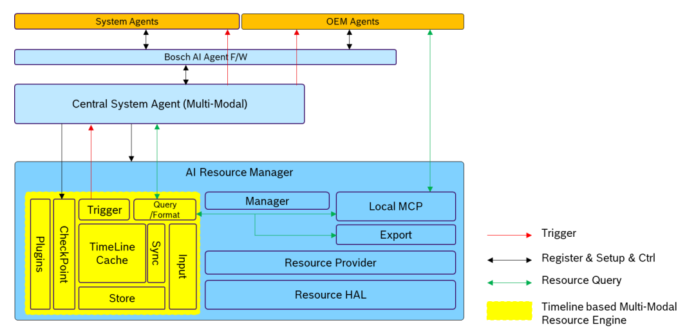
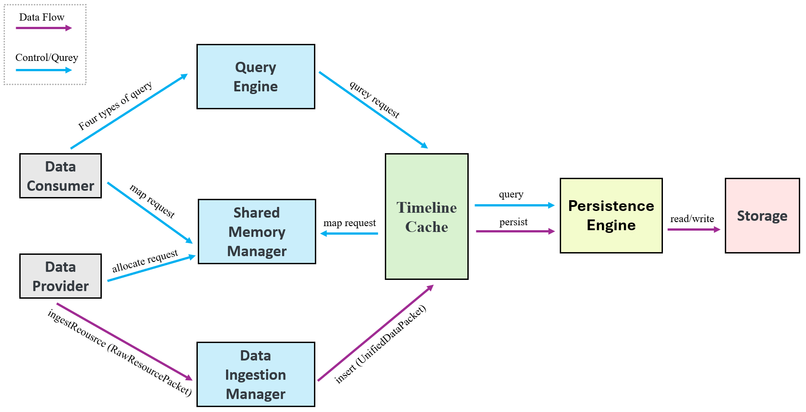
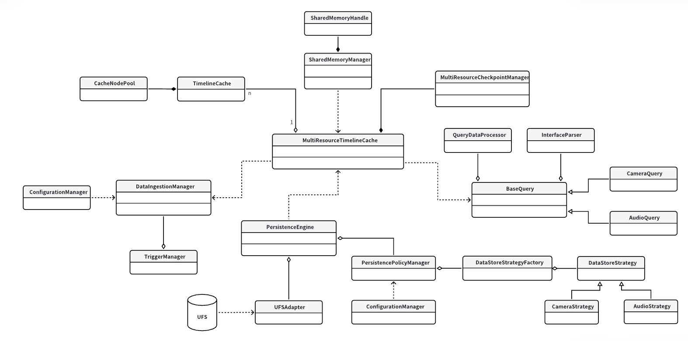

# 整体架构设计文档

### 1 引言
#### 1.1 项目背景
XC-CP AI 座舱基于对汽车座舱内外的场景理解，判断用户需求并提供主动式服务。本项目现在希望实现一个基于端侧大模型的智能座舱。为了实现这一目标，系统需要一个能够高效整合、管理并提供多模态数据（如车辆信号、音视频流、系统日志等）的核心组件（即本基于时间线的数据缓存管理引擎）。它作为系统资源层的核心，为大模型模块、智能体应用和其他系统应用提供了一个基于时间线的、统一、高效的数据访问入口。

如图所示，黄色底色部分是基于时间线的多模态资源引擎在整个系统的中的位置示意图。引擎作为资源层的核心模块，其输入来自于 Resource Provider，提供查询接口给到上层的 Agent 和 local MCP 使用。Agent 层在系统初始化时，会根据自身的业务场景的需求，配置 Resource Manager，告知所需的数据源及相关的触发规则。引擎监控多模态数据变化，在预定义的规则下，可以主动触发上层 Agent 工作。


#### 1.2 核心目标
引擎的核心设计目标如下：
- 数据统一管理：将来源各异、格式不同的多模态数据，统一在一条时间线上进行缓存与管理。
- 高效查询访问：为上层应用提供低延迟（Cache < 10ms, UFS < 100ms）的数据查询服务，支持多种查询模式。
- 智能数据生命周期：实现从内存缓存到持久化存储的智能、自动化的数据交换（Swap）与精简压缩（Downsampling）机制。
- 主动感知触发：内建触发器机制，能够根据预设规则主动监测数据变化，并通知上层智能体，实现“事件驱动”的主动服务。
- 高度可配置与可扩展：引擎的各项行为（如缓存策略、持久化规则、触发条件等）应支持灵活配置，并且易于扩展以支持新的数据资源类型。

#### 1.3 关键术语定义
- Resource：指一种特定类型的数据源，如 VehicleSignal、Camera 等。
- Timeline：一个逻辑上的、以时间为轴的序列，所有资源数据都根据其产生的时间戳被放置在这条时间线上。
- Cache：位于内存中的高速存储区域，用于存放近期、热点的数据。
- Persistence：位于UFS上的非易失性存储区域，用于长期保存经过精简处理的历史数据。
- Checkpoint：时间线上的一个特殊标记，代表一个有重要意义的时刻。可由Agent或Trigger设置，用于数据查询和持久化同步。
- Agent：引擎的上层消费者，是实现具体AI业务逻辑的应用或服务。

### 2 系统架构概览
#### 2.1 整体视图

本引擎位于座舱系统的资源层，是连接底层Resource Provider和上层Consumer(Agent, Local MCP)的核心枢纽。
- Upstream：各类 Resource Provider 通过各自的写入接口（后续提供基本设计），将带有时间戳的数据注入引擎的缓存区，会在更后续被（选择性地）存入UFS并从缓存中删除。
- Timeline Cache：负责数据的接收、解析、缓存、持久化、查询处理和事件触发。
- Downstream：Agent 和其他应用通过多样化的查询接口（Native API, SQL, RPC）从引擎获取数据，并通过配置接口管理引擎的行为。
#### 2.2 核心设计理念
- 时间线中心化 (Timeline-Centric)：所有设计都围绕“时间线”这一核心抽象展开，所有数据都必须拥有时间戳，所有操作（查询、同步）都基于时间进行。
- 分层与解耦 (Layering & Decoupling)：引擎内部逻辑清晰分层，将数据存储、查询逻辑、规则管理等功能解耦，便于独立开发、测试和优化。
- 插件化架构 (Plugin-based Architecture)：对于资源解读（Explainable）、数据精简、格式化输出等功能，采用插件化设计，极大地提高了系统的扩展性。
- 性能优先 (Performance First)：针对大数据量资源（如Camera）采用共享内存机制，优化写入和查询路径，确保满足严苛的性能指标。
#### 2.3 模块划分

多模态数据引擎内部包含以下模块：
- MultiResourceTimelineCache
多资源时间线缓存主入口，管理各资源类型的独立缓存实例

- TimelineCache
单资源时间线存储实现（AVL树+双向链表混合结构）

- CacheNodePool
节点内存池管理器，提供高效内存分配/回收

- SharedMemoryManager
共享内存分配/释放服务，维护引用计数

- SharedMemoryHandle
共享内存智能访问句柄，封装跨进程安全操作

- MultiResourceCheckpointManager
全局检查点管理服务，维护时间标记体系

- BaseQuery
查询抽象基类，定义统一处理流程

- CameraQuery/AudioQuery/...
资源特定查询实现，含定制优化逻辑

- QueryDataProcessor
数据后处理引擎，执行解释/压缩/分析等操作

- InterfaceParser
协议转换层，统一处理IPC/RPC/SQL/Native请求

- DataIngestionManager
数据摄入控制器，处理写入请求与流量控制

- TriggerManager
规则触发器，实现条件检测与动作执行

- ConfigurationManager
集中式配置管理，支持热加载与版本控制

- PersistenceEngine
持久化调度中心，协调缓存与存储的数据同步

- UFSAdapter
物理存储适配器，处理UFS读写操作

- PersistencePolicyManager
持久化策略工厂，选择最优数据处理策略

- DataStoreStrategy
策略抽象接口，定义process()方法规范

- CameraFrameSubsampling/AudioDownsampling/...
具体策略实现，完成资源特定压缩转换

### 4 数据结构设计
#### 4.1. 统一数据包 (UnifiedDataPacket)
``` c++
struct UnifiedDataPacket {
    long long timestamp_ns;      // 时间戳 (纳秒级)
    string resource_id;          // 资源唯一标识, e.g., "camera.front"
    ResourceType type;           // 资源类型枚举
    shared_ptr<void> data_payload; // 数据载荷指针
    size_t data_size;            // 数据大小
    bool is_shared_memory;       // 是否为共享内存// 
    ...
};
```
#### 4.2. 缓存数据结构 (Cache Structure)
- 主要结构: AVL平衡树结构，保证按时间戳有序，便于范围查询。
#### 4.3. 持久化数据结构 (Persistence Structure)
- 文件系统布局: /data/resource_engine/{YYYY-MM-DD}/{resource_id}/
- 数据文件: 在目录下，按小时或固定大小分块存储，如 14_00_00.dat。
- 索引文件: 每个目录下有一个索引文件 index.db，记录每个数据块的起始/结束时间戳和文件内偏移，加速查找。

### 5 功能性需求
基于时间线的多模态资源引擎的主要功能特性包括：
- 5.1 支持多模态数据基于时间线的缓存。
- 5.2 支持多模态数据的时间对齐处理。
- 5.3 支持多模态数据的查询，支持多种查询接口和格式化输出，输出模板可配置。
- 5.4 支持缓存交换同步到持久存储分区。
- 5.5 支持多模态数据按照预定规则和检查点时刻采样的方式精简存储到持久分区。
- 5.6 支持触发器功能，当数据的预定状态转换规则发生时，可以事件通知智能体层。
- 5.7 支持智能体层设置检查点。
- 5.8 支持触发器设置检查点。
- 5.9 支持检查点 list 查询。
- 5.10 对大数据量资源支持共享内存方式提供给智能体和模型使用。
- 5.11 支持启用/关闭指定资源的缓存。

### 6 非功能性需求满足方案
- 6.1 资源数据类型可扩展: 通过数据输入与适配层的适配器模式和持久化管理器的插件化精简策略，添加新资源类型只需实现新的适配器和可选的精简插件，无需修改引擎核心框架。
- 6.2 查询性能:
  - 缓存查询 (<10ms): 纯内存操作，使用高效的 std::map 或跳表，时间复杂度为 O(logN)，其中N为缓存条目数，完全可满足要求。
  - UFS查询 (<100ms): 通过优化的文件分块和索引文件，避免全盘扫描，直接定位到目标文件和大致位置，将I/O开销降至最低。
- 6.3 写入性能:
  - 简单资源 (<10ms): 写入操作被设计为一个平衡树的insert操作，因为AVL树处理时序数据的旋转操作有限且可控，可满足要求。
  - 复杂资源 (<10ms): 对于共享内存资源，写入的同样是句柄，操作本身很快。实际数据写入共享内存的耗时由Resource Provider保证。引擎的接收和记录过程远快于10ms。