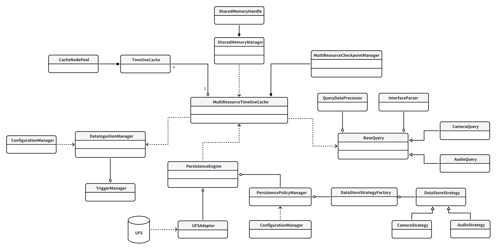

# 模块设计文档

这里对各个模块进行概述。所有模块更具体的描述和伪代码分散在“cache数据详细设计与伪代码”和“数据精简模块详细设计与伪代码”两个文档中。

## MultiResourceTimelineCache
系统核心是一个mulitresourceTimelinecache，它包含每种资源（如摄像头、音频、车辆信号等）一个TimelineCache。因为一些数据（视频流、音频流等大数据量资源）是直接以共享内存的形式存储的，mulitresourceTimelinecache还依赖一个sharememoryManager类，每次生成/删除一个新的SharedMemoryHandle都会调用它暴露的接口来对共享内存进行管理。
它还依赖一个PersistenceEngine，负责处理数据持久化相关逻辑。

## TimelineCache
每个TimelineCache都是一个AVL结构，维护该资源以timestamp为key的信息。基于AVL树+双向链表的混合数据结构实现，在时间序列场景中达到最优平衡。AVL树保证时间戳查找的O(logN)时间复杂度。每个节点包含时间戳、数据指针和前后节点引用，支持以下关键操作：插入新数据时自动平衡树结构，保持高度平衡；范围查询时利用链表遍历避免递归开销（将递归展开）；淘汰旧数据时通过链表头指针实现O(1)访问。

## CacheNodePool
每种资源维护一个独立的内存池，因为不同的资源类型,其数据包的大小和访问频率可能会有很大差异，管理策略也不同，混在一起很容易出现内存碎片。使用它来管理节点的malloc，就不会每次插入都要新malloc节点，可以极大程度提升效率。

## SharedMemoryManager
摄像头、audio这样的数据都需要用共享内存的形式来管理，就涉及到每次刚进入数据的时候的共享内存分配，以及监测共享内存的计数，在引用计数降为0之后负责这一块共享内存的回收和销毁。

## SharedMemoryHandle
负责共享内存的具体数据结构。内部包含内存指针、大小和原子引用计数，支持移动语义和空状态检测。关键特性包括：自动引用计数，拷贝构造时计数+1，析构时计数-1；线程安全操作，所有方法都通过原子变量保证一致性；

## MultiResourceCheckpointManager
MulitresourceCheckpointManager,管理checkpoints。每个checkpoint其实就是一个timestamp，这个模块维护这些timestamp的集合，并支持增删查操作。mulitresourceCheckpointManager被mulitresourceTimelinecache持有，支持插入/查询检查点，这两类查询都会经过mulitresourceTimelinecache的转发最终调用到CheckpointManager。无论是Query类直接查询checkpoint，还是PersistenceEngine在持久化的过程中要使用checkpoint信息，也都通过mulitresourceTimelinecache暴露出来的接口。

## BaseQuery CameraQuery AudioQuery...
其中，basequery类暴露给用户，收到用户发起的四类（IPC RPC SQL native接口）请求之后，basequery类会把它们统一交给InterfaceParser转为统一的查询接口，然后去调用mulitresourceTimelinecache查询，然后根据具体的指令情况决定是否要经过QueryDataProcessor类处理之后再返回给用户。basequery类针对各个不同的设备有不同的子类，比如一个大模型的需要摄像头数据的模块就可以持有cameraquery的子类，它们都有定制化的接口。

## QueryDataProcessor
有时，Query拿到数据之后要进行必要的后处理。一个典型的例子：Vehicle Signal要求Explainable：又比如存的数据可能是16 2 分别代表摄像头和一个行为，需要有一个方法去配置文件里读到它们的解释然后再翻译再返回给大模型。

## InterfaceParser
负责把用户发起的四类请求（IPC RPC SQL native接口）转为统一的查询接口。SQL解析器支持子集语法"SELECT * FROM camera WHERE ts BETWEEN A AND B"；RPC适配器处理Protobuf编码的请求；IPC模块通过共享内存传递大数据参数。采用递归下降解析算法，在语法分析阶段即进行查询优化，如将"ts > NOW()-1000"转换为绝对时间范围。

## DataIngestionManager
DataIngestionManager向各个Raw的数据源暴露了向mulitresourceTimelinecache注入数据的接口，同时组合一个TriggerManager提供trigger创建checkpoint的功能（比如在输入的时候检测到了特定的东西，就用triggerManager调用创建checkpoint的接口）。

## ConfigurationManager
很多支持扩展性的地方都是通过读配置文件实现的，比如有哪些类型的输入数据、输入数据的具体格式等等，这些配置文件都由ConfigurationManager管理。多个需要配置文件的类都会依赖它。

## TriggerManager
trigger创建checkpoint的功能（比如在输入的时候检测到了特定的东西，就用triggerManager调用创建checkpoint的接口）。支持多种触发模式，例如定时触发（每5秒）、阈值触发（速度>120km/h）、事件触发（检测到行人）、手动触发等等。

## PersistenceEngine
PersistenceEngine负责处理data sync相关逻辑。它持有一个PersistencePolicyManager，这个Manager会根据具体的数据精简策略（比如抽帧）得到准备存入UFS的数据。这个地方要联动PersistencePolicyManager，它要从ConfigurationManager获取每类数据如何精简化，并执行精简化逻辑，最简单的就是对camera数据抽帧、audio数据抽帧、保存checkpoint等等。这个策略是直接配置好的，可以把原始数据交给一个策略模式去process之后，把精简化好的数据交给ufsadapter。它同时持有一个UFSAdapter，负责真的从UFS读取/往UFS写入数据。

## UFSAdapter
存储抽象层，负责和UFS真正的交互。

## PersistencePolicyManager
数据在取出cache、准备持久化之前，要经过一个精简的流程。但每种数据怎么精简都需要自己的策略，这个类负责管理这些具体的策略。

## DataStoreStrategyFactory
真正精简逻辑策略的工厂模式设计。

## DataStoreStrategy CameraStrategy AudioStrategy
每个具体的执行数据精简逻辑的类，具体的类继承父类DataStoreStrategy,实现processtore函数。